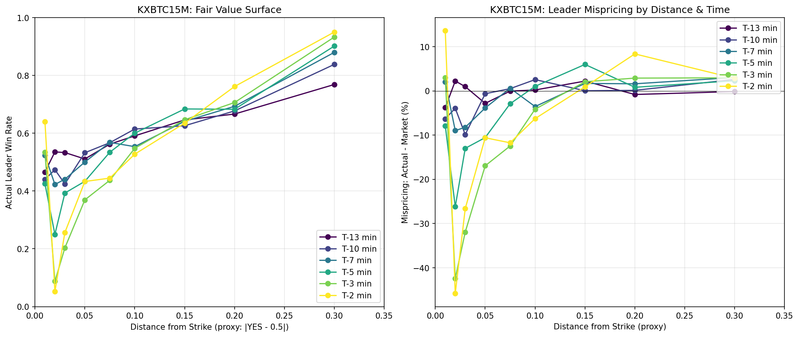
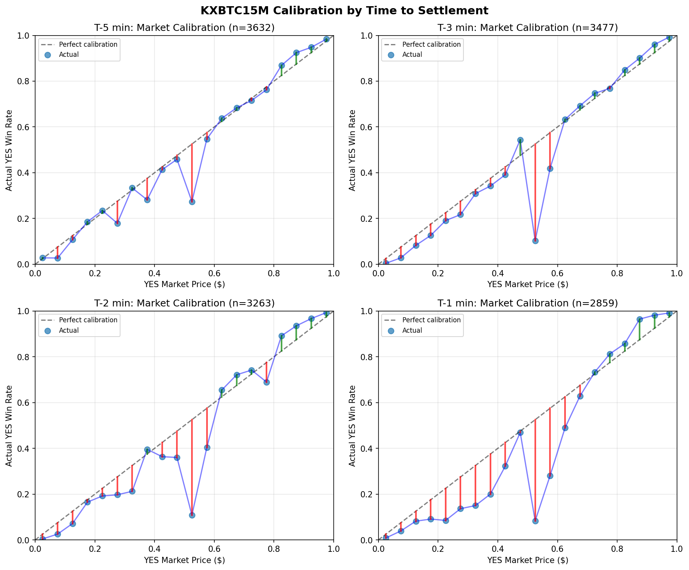
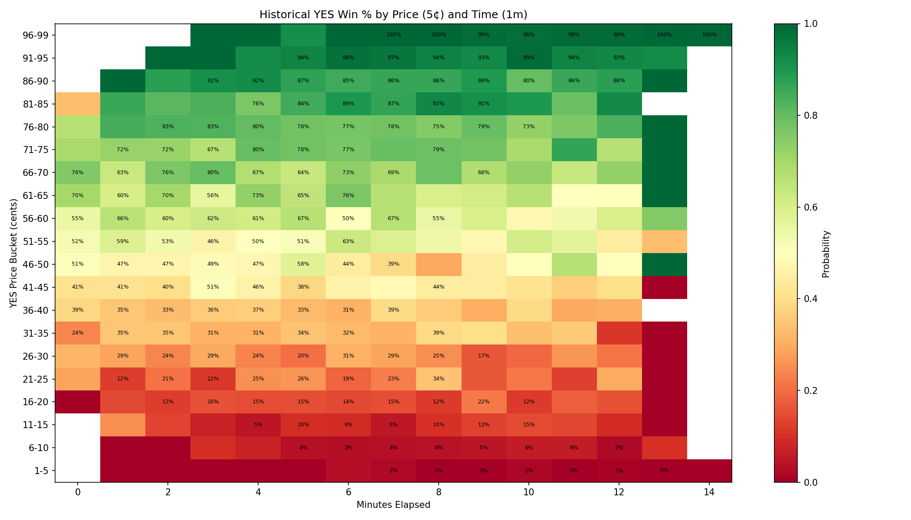
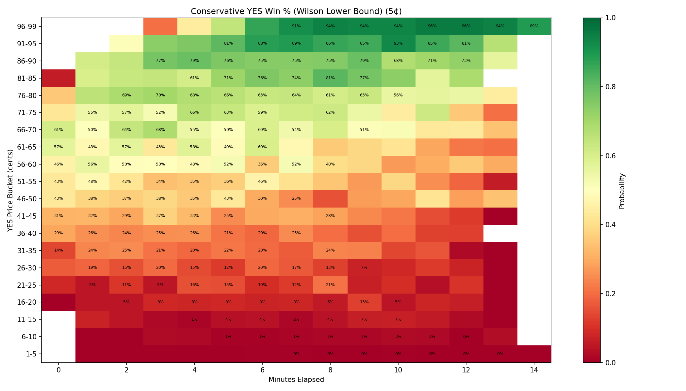
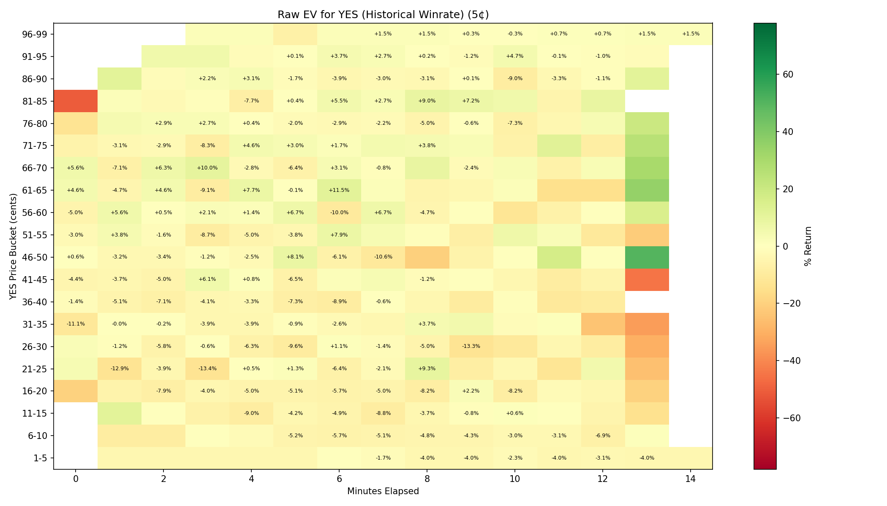
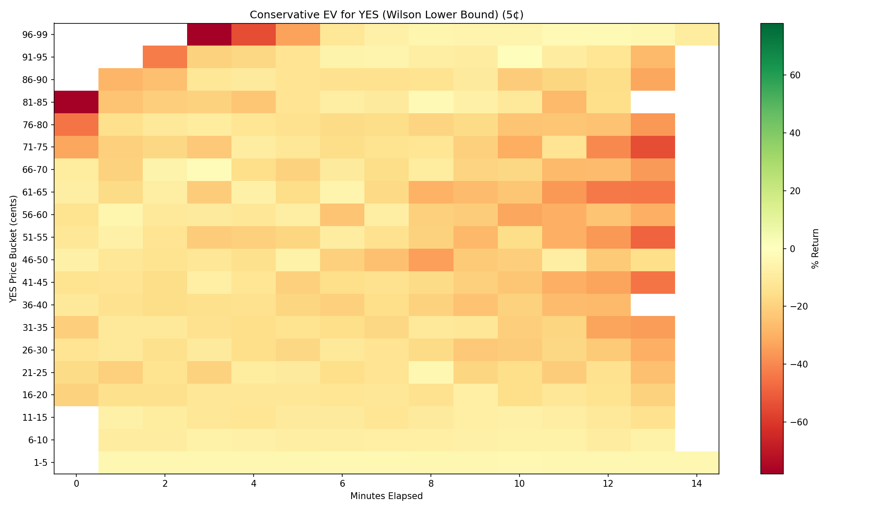
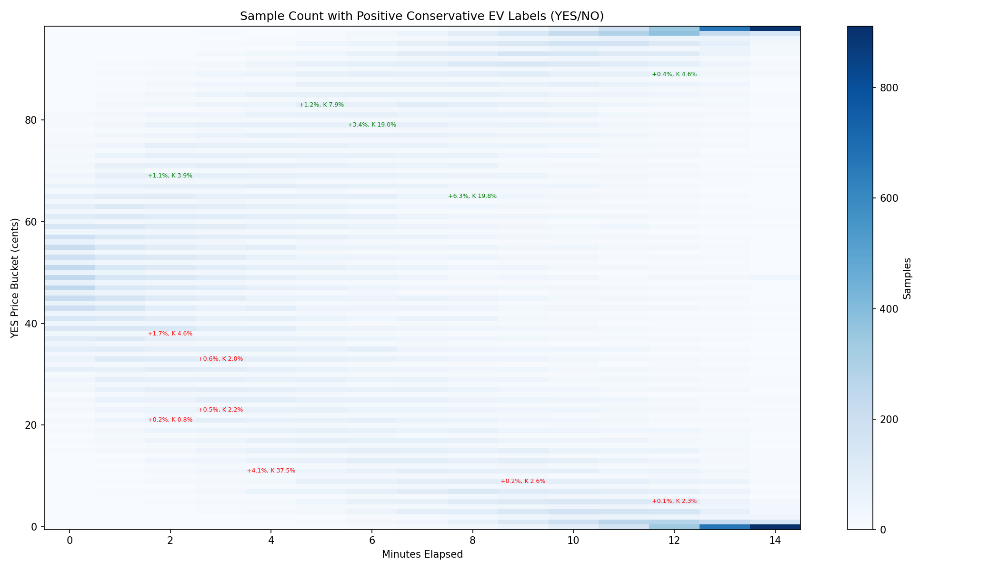
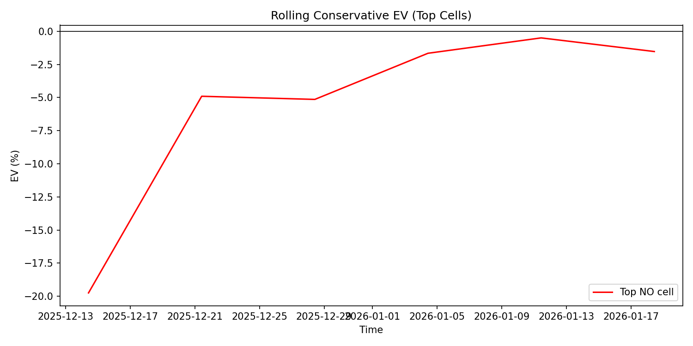
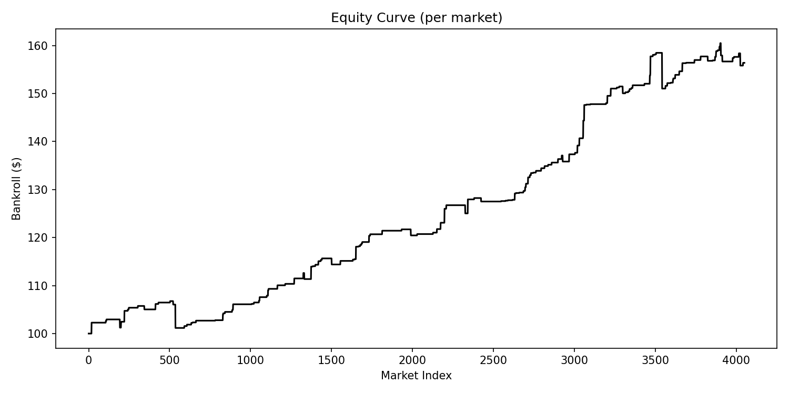

# Kalshi Paper Trader (Research + Execution Pipeline)

This repository is a trading/research project built around Kalshi event markets, with a newer streamlined pipeline for data collection, model training, evaluation, and live execution, plus a legacy archive of earlier strategy experiments.

If you are browsing this as a portfolio project, scroll down to the "Sample Output Gallery" section to view example PNG outputs from archived experiments (illustrative only).

## What This Repo Contains

- A refactored "active" pipeline for:
  - high-resolution market snapshot collection
  - label alignment from settled markets
  - RNN-based edge model training
  - strategy evaluation (fixed + walk-forward)
  - dry-run / live execution
- A legacy archive of prior scripts, backtests, and visual outputs kept for reference (`legacy/`)

## Project Highlights

- Unified snapshot schema (`pipeline/schemas.py`) used across training and runtime
- Reusable data + feature pipeline (`pipeline/data.py`)
- Torch LSTM classifier for market microstructure sequences (`pipeline/model.py`)
- Pluggable strategy runtime with built-in `rnn_edge_v1` and plugin support (`pipeline/strategy_runtime.py`)
- CLI scripts and `Makefile` targets for end-to-end operation

## Repository Layout

- `scripts/`: entrypoints for download, labeling, training, evaluation, and live execution
- `pipeline/`: core training/runtime logic and schemas
- `market_data/`: Kalshi HTTP/WS clients and market-selection helpers
- `config/`: runtime config defaults (paths + endpoints)
- `legacy/code/`: archived strategy research stacks and backtest utilities
- `legacy/artifacts/`: archived charts and experiment outputs

## Active Workflow (Current)

1. Collect high-resolution snapshots (`scripts/download_highres.py`)
2. Build or sync settlement labels (`scripts/build_labels.py`, `scripts/sync_labels_from_api.py`)
3. Train an RNN edge model (`scripts/train_edge_rnn.py`)
4. Evaluate strategy performance (`scripts/evaluate_strategy.py`)
5. Run the strategy executor (`scripts/run_live.py`)

## Notes for Reviewers

- Secrets are intentionally excluded from version control (`secrets/`, `.env`, `*.pem`).
- Runtime data and local training outputs (for example `pipeline_data/`) are excluded from the repo.
- Some legacy datasets / raw market-data caches are excluded, while legacy scripts and charts are retained.

## Getting Started

- Install dependencies from `requirements.txt`
- Create local auth files (see `config/runtime.json` and `.env.example`)
- Use `make help` to see common commands

For the detailed operational guide for the active pipeline (commands, config fields, and workflow examples), see `README.pipeline.md`.

## Sample Output Gallery

The PNGs below are sample output displays from archived experiments and diagnostics. They are illustrative only and are not intended to reflect accurate market data, validated signals, or real trading performance.

### Edge Finder Charts (Legacy)

_Sample output displays only (illustrative; not accurate market data)._

### Live Trader Visuals (Legacy)

_Sample output displays only (illustrative; not accurate market data)._

## Disclaimer

This is research/trading software and not financial advice. Use live trading functionality at your own risk.
